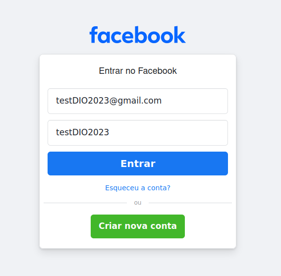

# cibersecurity-desafio-phishing

A ideia do desafio era fazer o passo a passo abaixo, porém ao tentar realizar foi encontrado obstáculos.

  # Phishing para captura de senhas do Facebook
  
  ### Ferramentas
  
  - Kali Linux
  - setoolkit
  
  ### Configurando o Phishing no Kali Linux
  
  - Acesso root: ``` sudo su ```
  - Iniciando o setoolkit: ``` setoolkit ```
  - Tipo de ataque: ``` Social-Engineering Attacks ```
  - Vetor de ataque: ``` Web Site Attack Vectors ```
  - Método de ataque: ```Credential Harvester Attack Method ```
  - Método de ataque: ``` Site Cloner ```
  - Obtendo o endereço da máquina: ``` ifconfig ```
  - URL para clone: http://www.facebook.com
  
  ### Resutados esperados
  
  

  ### Resultados encontrados

  

  ### Dados usados

  

Como não foi possível usar o método acima, usarei o método abaixo:

  # Phishing para captura de senhas do Google email
  
  ### Ferramentas
  
  - Kali Linux
  - setoolkit
  
  ### Configurando o Phishing no Kali Linux
  
  - Acesso root: ``` sudo su ```
  - Iniciando o setoolkit: ``` setoolkit ```
  - Tipo de ataque: ``` Social-Engineering Attacks ```
  - Vetor de ataque: ``` Web Site Attack Vectors ```
  - Método de ataque: ```Credential Harvester Attack Method ```
  - Método de ataque: ``` Web Templates ```
  - Template: ``` Google ```
  - Obtendo o endereço da máquina: ``` ifconfig ```

  ### Dados usados
 
  

  ### Resultados
 
  

